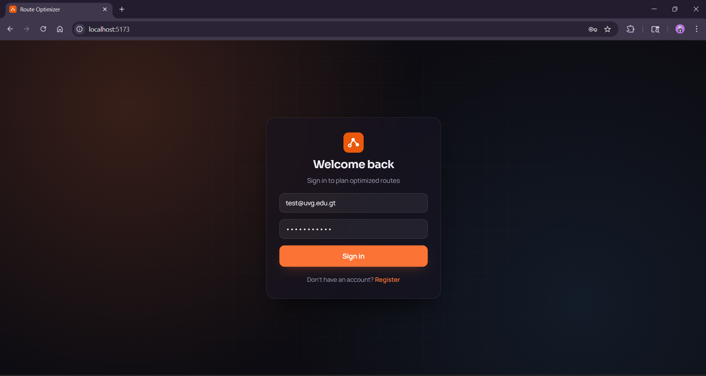
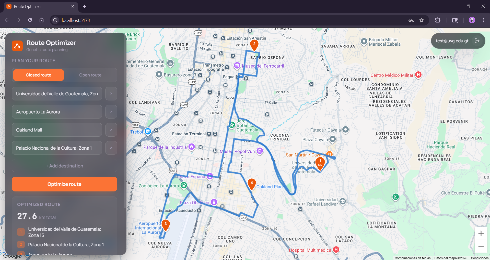

# Route Optimizer

> Developed by Marco Carbajal (23025), Carlos Aldana (23394), Diego Monroy (23318), and Carlos Angel (23010)

Route Optimizer is a web application that, given between 2 and 15 destinations within a maximum radius of 100 km, computes and visualizes the optimal route using a genetic algorithm. The optimization runs in a serverless Cloud Function, and the frontend displays the resulting route on an interactive map with a numbered pin per destination.

The user authenticates through Firebase, enters their destinations, chooses a route mode (closed or open), and the application returns the optimal visiting order along with the total distance of the trip.

---

## Features

- Route optimization with a genetic algorithm (Order Crossover, swap mutation, elitism, tournament selection)
- Real road distances via the Google Maps Distance Matrix API
- Closed-route (returns to origin) and open-route (ends at the last stop) modes
- Interactive map with a numbered pin per destination and the total distance on screen
- Firebase Authentication: only authenticated users can run the optimization
- IP allowlist enforcement on the Cloud Function
- Client-side and server-side validation of the 2–15 destinations and 100 km radius rules
- Responsive interface for desktop and mobile

---

## Architecture

```text
Frontend (React + Vite)
        │
        │  Firebase ID token + destinations
        ▼
Firebase Cloud Function (Python)
        │
        ├── IP allowlist check
        ├── Firebase Authentication check
        ├── Request validation (Pydantic: 2–15 stops, no duplicate IDs, 100 km radius)
        │
        ▼
Optimization Service
        │
        ├──► Distance Matrix Engine ──► Google Maps Distance Matrix API
        │
        └──► Genetic Algorithm ──► optimal order + total distance
        │
        ▼
Optimized Route Response (JSON)
        │
        ▼
Frontend renders the route on Google Maps
```

The backend is deployed as a single HTTP-triggered Firebase Cloud Function. There is no local server: the frontend always calls the deployed function.

---

## Technologies

| Layer | Technology |
|---|---|
| Frontend | React + Vite |
| Map | Google Maps JavaScript API |
| Backend | Firebase Cloud Functions (Python 3.12) |
| Optimization | Genetic algorithm |
| Distance engine | Google Maps Distance Matrix API |
| Authentication | Firebase Authentication |
| Validation | Pydantic |
| Secrets | Firebase Secret Manager |
| Python dependencies | uv |

---

## Project Structure

```text
route-optimizer/
├── README.md
├── .gitignore
├── .firebaserc                  # Firebase project alias
├── firebase.json                # Functions config (source: backend, runtime: python312)
│
├── backend/                     # Cloud Function source
│   ├── main.py                  # HTTP entry point: guards, auth, IP filter, pipeline
│   ├── pyproject.toml           # Python dependencies (managed with uv)
│   ├── uv.lock                  # Locked dependency versions
│   ├── requirements.txt         # Generated from pyproject.toml; used by Firebase at deploy
│   ├── .env.example             # Required backend variables (no real values)
│   ├── auth/
│   │   └── firebase_auth.py     # Firebase ID token verification
│   ├── security/
│   │   └── ip_filter.py         # IP allowlist enforcement (fail-closed)
│   ├── matrix_engine/
│   │   └── distance_matrix.py   # Google Maps Distance Matrix API calls
│   ├── genetic_engine/
│   │   └── genetic_algorithm.py # Genetic algorithm implementation
│   ├── services/
│   │   └── optimization_service.py  # Orchestrates matrix + genetic algorithm
│   └── shared/
│       └── schemas.py           # Pydantic request/response models + validation
│
├── frontend/                    # React + Vite app
│   ├── package.json
│   ├── vite.config.js
│   ├── index.html
│   ├── .env.example             # Required frontend variables (no real values)
│   └── src/
│       ├── App.jsx
│       ├── components/          # Login, DestinationForm, MapComponent
│       ├── services/            # firebase.js, cloudFunction.js
│       └── utils/               # distance.js (Haversine radius check)
│
└── diagrams/
    ├── flow.drawio              # User flow: login → route visualization
    └── architecture.drawio      # System architecture (GCP icons)
```

---

## Optimization Constraints

- Minimum destinations: 2
- Maximum destinations: 15
- All destinations must lie within a maximum radius of 100 km of each other
- Geographic coordinates are required for every destination
- Duplicate destination IDs are not allowed

The 100 km radius is validated on the client (using the Haversine formula, for fast feedback) and again on the backend (in the Pydantic schema, as the authoritative check).

---

## How the Genetic Algorithm Works

The optimization treats the route as a Traveling Salesman Problem:

- **Chromosome**: an ordered list of destination indices, with the origin fixed at the first position.
- **Fitness**: total route distance from the Distance Matrix; shorter is better. For closed routes, the return leg to the origin is included.
- **Selection**: tournament selection (k = 3).
- **Crossover**: Order Crossover (OX1), preserving the fixed origin and avoiding duplicated or missing stops.
- **Mutation**: swap mutation between two non-origin stops, applied according to the mutation rate.
- **Elitism**: the best individuals carry over unchanged to the next generation.
- **Stopping criterion**: a fixed number of generations.

The genetic hyperparameters (population size, generations, mutation rate) are fixed on the backend; the frontend only sends the route mode chosen by the user.

---

## Prerequisites

To run this project from scratch on a new machine you need:

- [Node.js](https://nodejs.org/) 20.19 or newer (22.13+ if you are on the v22 line) and npm
- [Python 3.12](https://www.python.org/)
- [uv](https://docs.astral.sh/uv/) for Python dependency management
- [Firebase CLI](https://firebase.google.com/docs/cli) (`npm install -g firebase-tools`)
- A Firebase project with:
  - Firebase Authentication enabled (Email/Password provider)
  - Cloud Functions enabled
- A Google Maps API key with the **Maps JavaScript API**, **Places API**, **Geocoding API**, and **Distance Matrix API** enabled

---

## Setup and Run

### 1. Clone the repository

```bash
git clone <repository-url>
cd route-optimizer
```

### 2. Configure the Firebase project

Log in and select your Firebase project:

```bash
firebase login
firebase use <your-firebase-project-id>
```

### 3. Backend — dependencies

Python dependencies are managed with **uv** through `backend/pyproject.toml`. Firebase installs them automatically from `backend/requirements.txt` during deployment, so you do not need to install them manually to deploy.

If you want a local virtual environment for development or to regenerate the requirements file:

```bash
cd backend
uv sync                                          # create the local environment from uv.lock
uv pip compile pyproject.toml -o requirements.txt # regenerate requirements.txt if dependencies change
cd ..
```

### 4. Backend — environment variables and secrets

The backend reads two values, provisioned through two different mechanisms. Start by copying the example file:

```bash
cd backend
cp .env.example .env
cd ..
```

- **`GOOGLE_MAPS_API_KEY` — a secret.** It is stored in **Firebase Secret Manager**, never in the repository and never in `.env`:

  ```bash
  firebase functions:secrets:set GOOGLE_MAPS_API_KEY
  ```

  You will be prompted to paste the key value. The function declares this secret (`secrets=["GOOGLE_MAPS_API_KEY"]` in `main.py`), so it is injected into the environment only at runtime. Leave this key out of `backend/.env` to avoid clashing with the Secret Manager value.

- **`ALLOWED_IPS` — a plain configuration value.** It is a comma-separated list of public IPs allowed to call the function, set in `backend/.env`. Firebase automatically loads `backend/.env` and ships its values as runtime environment variables on every deploy, so updating the allowlist is just a matter of editing `.env` and redeploying. If the list is empty, **all requests are rejected** (fail-closed).

  Example `backend/.env`:

  ```text
  # Comma-separated list of public IPs allowed to call the function
  ALLOWED_IPS=203.0.113.4,198.51.100.20
  ```

`backend/.env` is git-ignored (only `.env.example` is committed), so no real values ever land in the repository.

### 5. Deploy the Cloud Function

```bash
firebase deploy --only functions
```

When the deploy finishes, the CLI prints the function URL. Copy it — the frontend needs it in the next step. Because `backend/.env` is bundled at deploy time, this is also the command that publishes any change you make to `ALLOWED_IPS`.

### 6. Frontend — dependencies

```bash
cd frontend
npm install
```

### 7. Frontend — environment variables

Copy the example file and fill in your values:

```bash
cp .env.example .env
```

Edit `frontend/.env` with:

```text
# Google Maps JavaScript API (map + autocomplete + geocoding)
VITE_GOOGLE_MAPS_API_KEY=your_google_maps_key

# Firebase Authentication config (from your Firebase project settings)
VITE_FIREBASE_API_KEY=...
VITE_FIREBASE_AUTH_DOMAIN=...
VITE_FIREBASE_PROJECT_ID=...
VITE_FIREBASE_STORAGE_BUCKET=...
VITE_FIREBASE_MESSAGING_SENDER_ID=...
VITE_FIREBASE_APP_ID=...

# Deployed Cloud Function endpoint (from step 5)
VITE_CLOUD_FUNCTION_URL=https://...
```

The `.env` file is git-ignored and must never be committed.

### 8. Run the frontend

```bash
npm run dev
```

Open the URL printed by Vite (by default `http://localhost:5173`). Register or sign in, add your destinations, choose a route mode, and run the optimization.

> Note: the deployed Cloud Function only accepts requests from the IPs listed in `ALLOWED_IPS` (in `backend/.env`). To call it from your own machine during development, add your current public IP to that list and redeploy the function (`firebase deploy --only functions`).

---

## Security

- **Authentication**: every optimization request must carry a valid Firebase ID token; the function rejects unauthenticated calls.
- **IP allowlist**: the function checks the caller IP against `ALLOWED_IPS` before doing any work, and rejects any IP that is not listed (fail-closed).
- **Secrets and configuration**: the Google Maps API key lives in Firebase Secret Manager and is injected only at runtime; the IP allowlist lives in the git-ignored `backend/.env`. No API keys or credentials are committed to the repository — only the `.env.example` templates are tracked.

---

## Diagrams

The `diagrams/` folder contains:

- **User flow** (`flow.drawio`): from login to route visualization.
- **System architecture** (`architecture.drawio`): the full system using official Google Cloud Platform icons.

Both are provided as `.drawio` files and exported to PDF/PNG.

---

## Screenshots

The screenshots below live in the `screenshots/` folder at the repository root.

### Login

The Firebase email/password sign-in screen.



### Application interface

The main interface: the floating control panel over the full-screen map, with the optimized route and its numbered pins.



---

## Module Documentation

- [Backend documentation](./backend/README.md)
- [Frontend documentation](./frontend/README.md)

---

## Contributors

| Name | ID |
|---|---|
| Marco Carbajal | 23025 |
| Carlos Aldana | 23394 |
| Diego Monroy | 23318 |
| Carlos Angel | 23010 |

---

## License

Academic project developed for educational purposes.